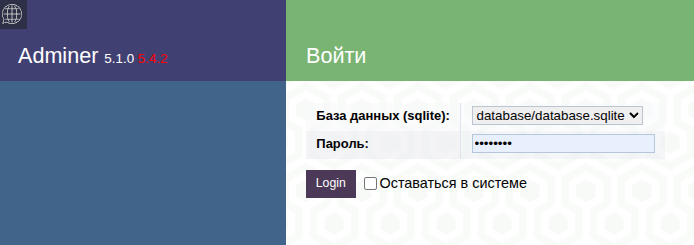

# Выгрузка данных из API https://github.com/cy322666/wb-api

## Установка
```bash
git clone git@github.com:vamcart/fetch-api-data.git
cd fetch-api-data 
composer install
cp .env.example .env
php artisan key:generate
```
## Запускаем миграции
```bash
php artisan migrate
```

## Команды для выгрузки данных
```php
php artisan app:fetch-sales --dateFrom=2026-05-20
php artisan app:fetch-orders --dateFrom=2026-05-20
php artisan app:fetch-stocks
php artisan app:fetch-incomes --dateFrom=2026-01-20
```

## Запуск
Стартуем встроенный веб-сервер:
```php
php artisan serve
```
Смотрим записанные в базу данные
```php
http://127.0.0.1:8000/sales
http://127.0.0.1:8000/orders
http://127.0.0.1:8000/stocks
http://127.0.0.1:8000/incomes
```

## Adminer
Смотрим базу данных через adminer:
```php
http://127.0.0.1:8000/sqlite.php
```
```bash
Выбираем __database/database.sqlite__
Пароль __12345678__
```
## Adminer
```bash
sales
orders
stocks
incomes
```




## Запуск по расписанию
Добавляем в `routes/console.php`:
```php
Schedule::command('app:fetch-sales')->everyMinute();
Schedule::command('app:fetch-orders')->everyFiveMinutes();
Schedule::command('app:fetch-stocks')->everyTenMinutes();
Schedule::command('app:fetch-incomes')->everyThirtyMinutes();
```
Запускаем планировщик: `php artisan schedule:work` , либо добавляем в cron строку запуска планировщика:

```php
* * * * * cd /путь/к/вашему/проекту && php artisan schedule:run >> /dev/null 2>&1
```

Данные из API будут выгружаться по расписанию.

